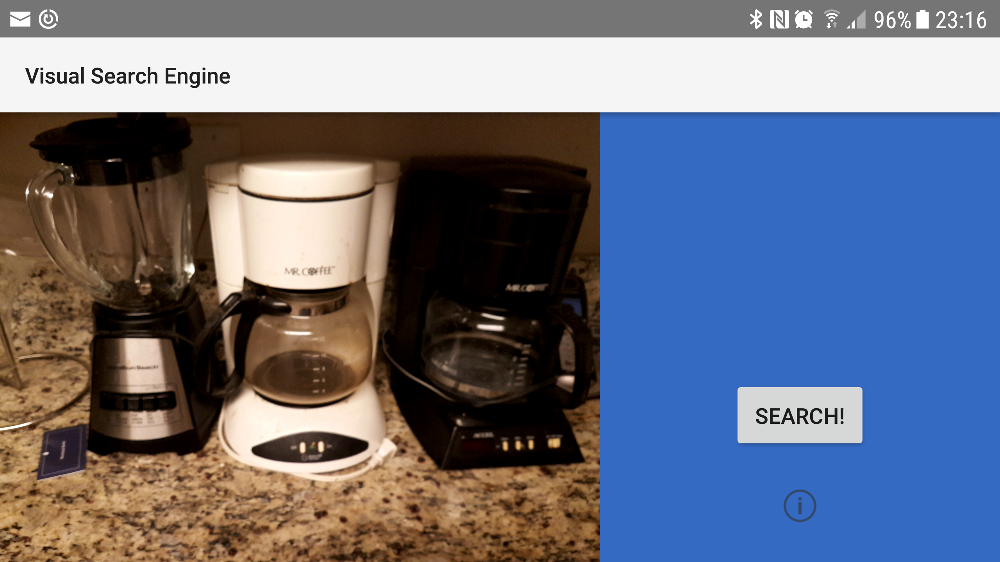
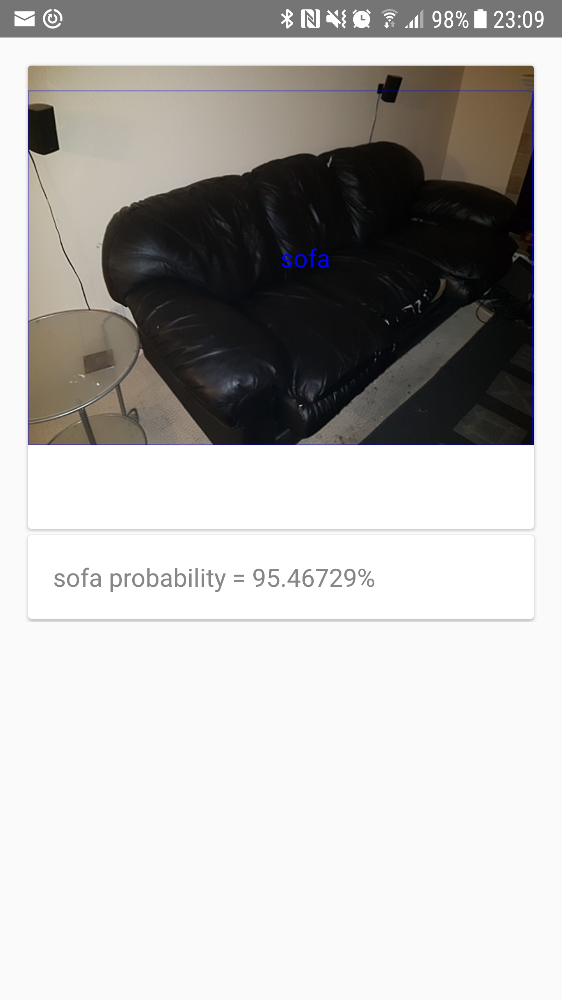
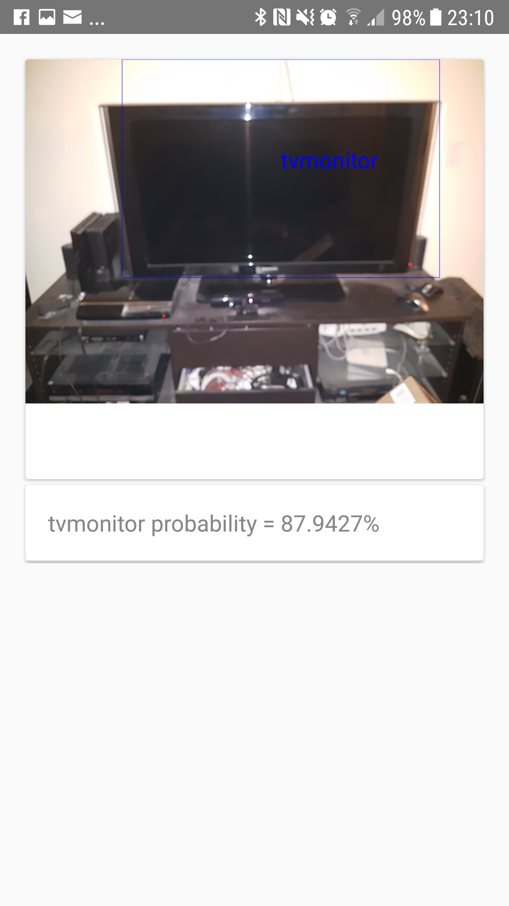

# Visual Search Engine

## Object Detection Project for EECS 6895, Columbia University, Spring 2017

* This project is based off of [Android-Object-Detection](https://github.com/tzutalin/Android-Object-Detection). This version breaks the dependency on the /sdcard path (not all devices, such as Samsung Android phones have this path) and moves object detection rendering from the OpenCV layer to the Android layer. These changes make the demo completely runnable on any Android device.

* Android 4.0+ support (for Visual Search Engine Project)

* ARMv7 or x86 based device (the OpenCV libraries that do the object detection are built for these CPU types)

* Build with Gradle. You can use Android studio to build as well.

* Uses Fast RCNN with selective search to identify objects.

* Other Fast RCNN models can be loaded for object detection. To do so, copy network (deploy.prototxt file) and model to visualsearchengine directory on internal memory; Moreover, deploy.prototxt should use ROILayer (see https://github.com/rbgirshick/fast-rcnn for more information). To adjust or see paths, see VisionClassifierCreator.java.

* Scene detection is also possible with this program, but has been disabled.

## Screenshots







## Usage 

* Download and push the neccessary files to your phone to the paths specified above. Sample model and network file for object detection can be downloaded by running setup.sh.

` $ ./setup.sh `

* Build and run the application using  gradlew or you can open AndroidStudio to import this project

` $ ./gradlew assembleDebug`

` $ adb install -r ./app/build/outputs/apk`

You can change the deep learning model, weight, etc in VisionClassifierCreator.java
``` java

public class VisionClassifierCreator {
    private final static String SCENE_MODEL_PATH = "..";
    private final static String SCENE_WIEGHTS_PATH = "..";
    private final static String SCENE_MEAN_FILE = "..";
    private final static String SCENE_SYNSET_FILE = "..";

    private final static String DETECT_MODEL_PATH = "..";
    private final static String DETECT_WIEGHTS_PATH = "..";
    private final static String DETECT_MEAN_FILE = "..";
    private final static String DETECT_SYNSET_FILE = "..";
 }
``` 

## TODO
Speed up object detection by either switching to faster RCNN or pushing detection work to a server.

## License

	    Copyright (C) 2017 Ihimu Ukpo
	
	Licensed under the Apache License, Version 2.0 (the "License");
	you may not use this file except in compliance with the License.
	You may obtain a copy of the License at
	
	     http://www.apache.org/licenses/LICENSE-2.0
	
	Unless required by applicable law or agreed to in writing, software
	distributed under the License is distributed on an "AS IS" BASIS,
	WITHOUT WARRANTIES OR CONDITIONS OF ANY KIND, either express or implied.
	See the License for the specific language governing permissions and
	limitations under the License.
